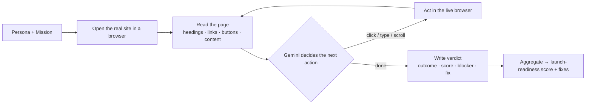

<div align="center">

# path-finder-0

### AI GTM QA before you send traffic

**path-finder-0 sends autonomous AI buyer personas through your live website on real go-to-market missions, finds exactly where each one fails to convert, and generates the precise fixes — _before_ you spend a dollar on launch, outbound, or ads.**


<br/>


<sub>Four autonomous AI personas — Developer, Founder, Enterprise Buyer, Student — running real missions against a site, in parallel.</sub>

</div>

---

## The problem

Startups spend weeks building a website, then point launch traffic, outbound, and ad spend at a funnel **they have never tested from a buyer's point of view.**

Analytics only tells you the launch leaked *after* you've already paid for the clicks. By then the developer who couldn't find your quickstart, and the enterprise buyer who couldn't find your security page, are already gone.

## The solution

**path-finder-0 runs your buyers through the funnel first.** It dispatches autonomous AI buyer personas — each with a distinct GTM mission — through your **live website**. Each persona drives a real browser ([browser-use](https://github.com/browser-use/browser-use) + Gemini 3.5), navigates like a real visitor, gets stuck where real visitors get stuck, and reports back:

- **Can a developer find the quickstart?**
- **Can a founder map the product to a concrete use case?**
- **Can an enterprise buyer find security/trust before the demo CTA?**
- **Can a student find a starter template?**
- **Where exactly did each one give up — and what copy / CTA / section would fix it?**

It returns a per-persona launch-readiness score, the exact confusion point and conversion blocker, a first-person quote, and a copy-pasteable fix.

> **path-finder-0 is not a chatbot, not a generic site audit, and not a fake-analytics dashboard.** It's mission-based AI website testing — pre-launch GTM QA for startups.

---

## It runs on real sites

Point a persona at any URL and it actually navigates it. A real run of the **Developer** persona against **fetch.ai**:

```
Developer — SUCCESS · 95/100
 1. open fetch.ai
 2. accept cookies, scan for a developer path
 3. click "Get Started"
 4. click "uAgents Resources"
 5. wait for the docs SPA to hydrate
 6. click "Quickstart" in the sidebar
 7. ✅ reached uagents.fetch.ai/docs/quickstart

 “I was impressed how fast I could find a local, self-hosted Python
  quickstart — 2 commands and a simple script to get an agent running.”

 Fix → Add a one-click "Create uAgent" starter-template CLI command or a
       zip download on the quickstart page to skip manual file creation.
```

The agent handled a cookie banner, a marketing → docs domain jump, and an SPA that needed a hydration wait — then wrote a grounded, persona-specific verdict.

---

## How it works

Each persona runs an **observe → decide → act** loop against a real browser, then writes a verdict:



### Run modes

| Mode | What runs | When |
| --- | --- | --- |
| 🌐 **Live** | **browser-use + Gemini 3.5** drive a real Chromium through your real site, persona by persona | you enter any URL in setup |
| ⚡ **Sample** | a built-in environment (the *AgentGrid* site) for an instant, zero-setup run + before/after | the default in setup |

Live runs degrade safely — if browser-use is unavailable they fall back to an in-process Playwright + OpenAI agent, then to a neutral verdict — so a run never hard-fails. The sample mode is fully self-contained and needs no keys.

---

## Quick start

```bash
npm install
npm run dev          # → http://localhost:3000
```

Open the app, go to **Setup**, and pick a target:

- **⚡ Sample** — runs instantly against the built-in site, no setup.
- **🌐 Live website** — paste a real URL (e.g. `https://fetch.ai`) and watch the personas test it for real.

### Enable live runs (browser-use + Gemini)

```bash
# 1) a Python env with browser-use (installs its own browser the first time)
cd agent && python3 -m venv .venv && .venv/bin/pip install -r requirements.txt && cd ..

# 2) configure .env
USE_BROWSER_USE=true
PYTHON_BIN=/absolute/path/to/path-finder-0/agent/.venv/bin/python
GEMINI_API_KEY=...            # or GOOGLE_API_KEY
GEMINI_MODEL=gemini-3.5-flash
```

See [`agent/README.md`](agent/README.md) for details (and how to reuse an existing browser-use venv). Restart `npm run dev`, choose **Live website**, and run.

---

## Architecture

```
src/
  app/
    page.tsx · setup · run · results          # the product
    demo-site/… · demo-site-improved          # the built-in sample site (+ its fixed version)
    api/run · api/generate-fixes              # run engine + fix generation
  components/   LaunchHero · SetupForm · PersonaRunCard · JourneyTimeline
                ResultsDashboard · FixCard · BeforeAfterPreview · ReRunMoment · DemoSiteLayout
  lib/          runEngine        # routes a run to the right engine (live vs sample)
                browserUseAgent  # bridge to the browser-use + Gemini agent
                browserAgent     # in-process Playwright + OpenAI fallback agent
                ai · personas · fixGenerator · score · types · brand
agent/
  persona_run.py                 # browser-use + Gemini runner (spawned per live run)
```

**Stack:** Next.js 15 (App Router) · React 19 · TypeScript (strict) · Tailwind v3 · **browser-use + Gemini 3.5** for live runs · Playwright + OpenAI as fallback · in-memory run store (no DB required).

---

## Roadmap

- **Cloud browsers** (Browserbase / Stagehand) for scale + an embedded **live browser view & session replay** attached to every finding.
- **Authenticated funnels** — test signup → activation behind a login with test credentials.
- **GTM QA in CI** — run against every Vercel / Netlify preview deploy and trend launch-readiness over time.
- **Custom personas / ICPs** and **auto-generated fix PRs**.

---

<div align="center"><sub>path-finder-0 — pre-launch GTM QA for startups</sub></div>
