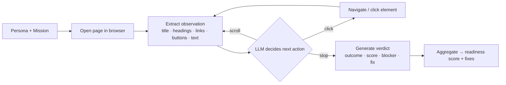

<div align="center">

# path-finder-0

### AI GTM QA before you send traffic

**Autonomous AI buyer personas navigate your website on real go-to-market missions, find exactly where each one fails to convert, and generate the precise fixes — _before_ you spend a dollar on launch, outbound, or ads.**


<br/>


<sub>Four autonomous AI personas — Developer, Founder, Enterprise Buyer, Student — running real missions against a live site, in parallel.</sub>

</div>

---

## The problem

Startups spend weeks building a website, then point launch traffic, outbound, and ad spend at a funnel **they have never tested from a buyer's point of view.**

Analytics only tells you the launch leaked *after* you've already paid for the clicks. By then the developer who couldn't find your quickstart, and the enterprise buyer who couldn't find your security page, are already gone.

## The solution

**path-finder-0 runs your buyers through the funnel first.** It dispatches autonomous AI buyer personas — each with a distinct GTM mission — through your website. They navigate like real visitors, get stuck where real visitors get stuck, and report back:

- **Can a developer find the quickstart?**
- **Can a founder map the product to a concrete use case?**
- **Can an enterprise buyer find security/trust before the demo CTA?**
- **Can a student find a starter template?**
- **Where exactly did each one give up — and what copy/CTA/section would fix it?**

Then it generates the exact fixes and **re-runs the persona to prove the fix worked.**

> **path-finder-0 is not a chatbot, not a generic site audit, and not a fake-analytics dashboard.** It's mission-based AI website testing — pre-launch GTM QA for startups.

---

## How it works

Each persona runs an **observe → decide → act** loop against a real, headless browser, then writes a verdict:



It runs in one of three modes, chosen automatically — and **every mode degrades safely to the next on any error, per persona**, so a missing key or a flaky page never breaks a run:

| Mode | When | What happens |
| --- | --- | --- |
| 🌐 **Live browser** | `USE_BROWSER_AGENT=true` | Real Playwright Chromium navigates the site; an LLM (or heuristic) picks each action |
| 🧠 **AI** | `OPENAI_API_KEY` set | An LLM reasons over the page model step by step and writes each verdict |
| ✅ **Fallback** | default | Deterministic, polished persona journeys — reliable for demos with zero setup |

The demo ships with a **controlled, intentionally-flawed sample site** (`/demo-site`, "AgentGrid") and its **fixed version** (`/demo-site-improved`), so the before/after story is reproducible without depending on a third-party site.

---

## Why now

- **LLMs can finally read and reason about a page like a buyer** — judging whether a value prop is clear or a CTA is findable, not just scraping text.
- **Agentic browser infra matured** (Playwright, headless cloud browsers) — driving a real browser through a real funnel is now routine.
- **Inference got cheap enough** to run several personas, several steps each, for cents.

The pieces to test a funnel the way a *human buyer* would just landed. path-finder-0 puts them to work before launch — the highest-leverage moment, when a copy change is free and a wasted ad dollar isn't.

---

## What's real today vs. where it's going

We're honest about the line (judges should be too):

**Real today**
- Genuine observe→decide→act agent loop over a real headless browser (`src/lib/browserAgent.ts`).
- Real LLM-driven navigation + verdicts when a key is present (`src/lib/ai.ts`).
- Real generated, copy-pasteable fixes mapped to concrete blockers.
- A reproducible before/after with a measurable re-run delta.

**Demo-controlled (by design, for reliability)**
- Runs against a built-in sample site so the narrative lands every time.
- Deterministic fallback so it never breaks on stage.

**Roadmap to the real thing**
- **Point it at any live URL** with cloud browsers (Browserbase / Stagehand) — paste your site, agents crawl it for real.
- **Test authenticated onboarding** (signup → activation) with test credentials.
- **Live session replay** — record each persona's browser session as video, attached to every finding.
- **GTM QA on every deploy** — run against Vercel/Netlify preview URLs in CI; track launch-readiness over time.
- **Custom personas/ICPs** and **auto-generated fix PRs**.

---

## Quick start

```bash
npm install
npm run dev          # → http://localhost:3000
```

That's it — **the full demo works with no API keys and no browser install** (deterministic fallback mode).

<details>
<summary><b>Optional: real AI reasoning</b></summary>

```bash
cp .env.example .env.local
# set in .env.local:
OPENAI_API_KEY=sk-...
OPENAI_MODEL=gpt-4o-mini   # default
```
Without a key, path-finder-0 uses the fallback agent automatically — nothing breaks.
</details>

<details>
<summary><b>Optional: real browser navigation (Playwright)</b></summary>

```bash
npm run playwright:install   # one-time: installs Chromium
```
Then set `USE_BROWSER_AGENT=true` (and `HEADLESS=false` to watch it live) in `.env.local`, with the dev server running. Any Playwright failure falls back to the deterministic result — the demo never breaks.
</details>

---

## Tech stack

**Next.js 15** (App Router) · **React 19** · **TypeScript** (strict) · **Tailwind CSS v3** · **Playwright** (optional, lazy-loaded) · **OpenAI** (optional, lazy-loaded) · in-memory run store (no DB required).

```
src/
  app/
    page.tsx · setup · run · results          # the product
    demo-site/… · demo-site-improved          # the site under test (+ its fix)
    api/run · api/generate-fixes              # run engine + fix generation
  components/   LaunchHero · SetupForm · PersonaRunCard · JourneyTimeline
                ResultsDashboard · FixCard · BeforeAfterPreview · ReRunMoment · DemoSiteLayout
  lib/          runEngine · ai · browserAgent · fallbackAgent · fixGenerator
                personas · types · store · score · seed · brand
```

The product name lives in one place — `src/lib/brand.ts`.

---

<div align="center"><sub>Built for the YC AI Growth Hackathon · pre-launch GTM QA for startups</sub></div>
